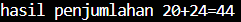

# Praktikum3
Repositori ini dibuat dengan tujuan memenuhi tugas yang diberikan.
Berikut adalah penjelasan kode yang ada dalam repositori ini.

# Daftar Isi

1. [Latihan 1](#L1)
2. [Latihan 2](#L2)
3. [Bilangan terbesar dari 3 Bilangan](#B3B)
4. [Bilangan terbesar dari N Bilangan](#BNB)

## [Latihan 1](<program/Latihan 1.py>) <a name="L1"></a>

1. Penggunaan ```end```
```ruby
print('A',end=' ')
print('B',end=' ')
print('C',end=' ')
print()
print('X')
print('Y')
print('Z')
```
```end=' '``` berfungsi untuk mengganti akhiran ```print()```, yang tadinya membuat baris baru setiap kali digunakan menjadi spasi setiap kali digunakan.

Hasil outputnya seperti berikut:


2. Penggunaan ```Separator```
```ruby
w,x,y,z=10,15,20,25
print(w,x,y,z)
print(w,x,y,z,sep=',')
print(w,x,y,z,sep='')
print(w,x,y,z,sep=':')
print(w,x,y,z,sep='-----')
```
```sep=``` berfungsi untuk memberikan pemisah diantara setiap nilai yang akan di cetak.

Hasilnya seperti berikut:


3. Penghitungan Kuadrat
```ruby
print(0, 10**0)
print(1, 10**1)
print(2, 10**2)
print(3, 10**3)
print(4, 10**4)
print(5, 10**5)
print(6, 10**6)
print(7, 10**7)
print(8, 10**8)
print(9, 10**9)
print(10, 10**10)
```
fungsi kode ini untuk menkuadratkan bilangan.

Hasilnya seperti berikut:


4. String Format
```ruby
print('{0:>3} {1:>16}'.format(0, 10**0))
print('{0:>3} {1:>16}'.format(1, 10**1))
print('{0:>3} {1:>16}'.format(2, 10**2))
print('{0:>3} {1:>16}'.format(3, 10**3))
print('{0:>3} {1:>16}'.format(4, 10**4))
print('{0:>3} {1:>16}'.format(5, 10**5))
print('{0:>3} {1:>16}'.format(6, 10**6))
print('{0:>3} {1:>16}'.format(7, 10**7))
print('{0:>3} {1:>16}'.format(8, 10**8))
print('{0:>3} {1:>16}'.format(9, 10**9))
print('{0:>3} {1:>16}'.format(10, 10**10))
```
```format()``` berfungsi untuk mengatur posisi output.

Hasilnya seperti berikut:


## [Latihan 2](<program/Latihan 2.py>) <a name="L2"></a>

1. Pada bagian ini
```ruby
a = input("masukan nilai a: ") 
b = input("masukan nilai b: ") 
```
Python akan meminta ```input()``` dari Pengguna, apapun yang diinputkan akan disimpan sebagai string di dalam variable ```a``` & ```b```.

2. Berikutnya
```ruby
print("variable a =", a)
print("variable b =", b)
```
Python akan menampilkan nilai variable ```a``` & ```b``` yang baru saja dimasukuan oleh Pengguna.


3. Di sini
```ruby
print("hasil penggabungan variable {}&{}={}".format(a, b, a+b)) 
```
Python akan menggabungkan 2 variable dan menampilkannya ke pengguna dan ini bukanlah penjumlahan.


4. Lalu 
```ruby
a = int(a)
b = int(b)
```
Disini Python akan mengubah nilai variable ```a``` & ```b``` menjadi ```int()``` integer.

5. Terakhir
```ruby
print("hasil penjumlahan {}+{}={}".format(a, b, a+b))
print("hasil pembagian {}/{}={}".format(a, b, a/b if a != 0 else "undefined"))
```
Python akan melakukan Aritmatika Penjumlahan dan Pembagian yang kemudian akan ditampilkan ke Pengguna.



## [Mencari Bilangan Terbesar dari 3 Bilangan](<program/Bilangan terbesar dari 3 bilangan.py>) <a name="B3B"></a>

Flowchart untuk Kode ini:


1. Menginputkan Bilangan 
```ruby
a = int(input("bilangan pertama: "))
b = int(input("bilangan kedua: "))
c = int(input("bilangan ketiga: "))
```
Pengguna akan diminta untuk masukan ```input()``` bilangan, kemudian ```input()``` itu akan dikonversikan menjadi ```int()``` integer.

2. Mendefinisikan Fungsi
```ruby
def terbesar(a, b, c):
```

3. Pengecekan
```ruby
    if a == b == c:
        print(f"Semua bilangan bernilai sama {a}")
```
Apabila semua bilangan sama, maka ``` Semua bilangan bernilai sama ``` akan ditampilkan. 

Output akan seperti ini:


4. Pengecekan ke-2
```ruby
    else:
        terbesar = max(a, b, c)
        print(f"bilangan yang terbesar adalah: {terbesar}")
```
Pengecekan akan berlanjut ke tahap ke-2 jika terdapat bilangan berbeda.

Outputnya akan seperti ini:


5. Memanggil Fungsi
```ruby
terbesar(a, b, c) 
```
Gunanya adalah untuk mengeksekusi fungsi tersebut.

## [Mencari Bilangan Terbesar dari N Bilangan](<program/Bilangan terbesar dari N bilangan.py>) <a name="BNB"></a>

Flowchart untuk Kode ini:


1. Inisialisasi variabel maksimum
```ruby
bilangan_maksimal = float('-inf')
```
 untuk mencari bilangan terbesar, bilangan maksimum wajib dimulai dari sama dengan tak hingga 

2. input jumlah bilangan
```ruby
n = int(input("Masukkan jumlah bilangan: "))
```
Di bagian Python akan meminta jumlah bilangan atau iterasi yang akan dimasukan oleh pengguna

3. perulangan
```ruby
while n > 0:
    bilangan = int(input("Masukkan bilangan: "))
```
Python akan terus mengulang permintaan input bilangan apabila n masih lebih besar dari 0

4. pengecekan
```ruby
if bilangan > bilangan_maksimal:
        bilangan_maksimal = bilangan
```
Python akan cek apakah bilangan lebih besar dari yang maksimal saat ini, jika itu terjadi maka python akan mengganti bilangan maksimal dengan bilangan tersebut

5. pengurangan iterasi
```ruby
n -= 1
```
ini terus terjadi dan kembali ke poin 3 apabila n masih lebih besar dari 0

7. Output
sebagai contoh maka hasilnya seperti berikut


